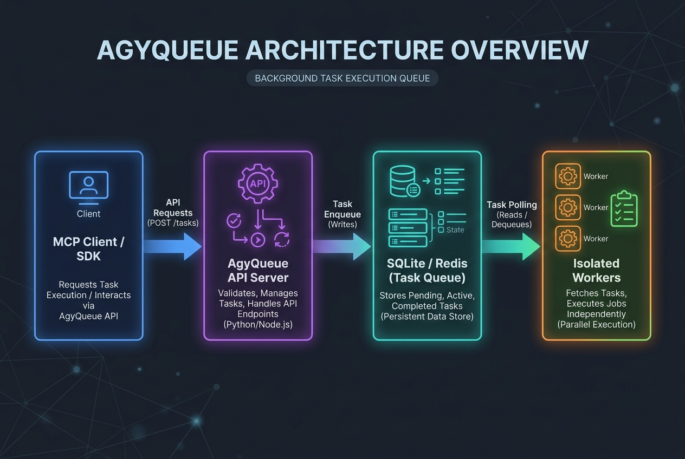
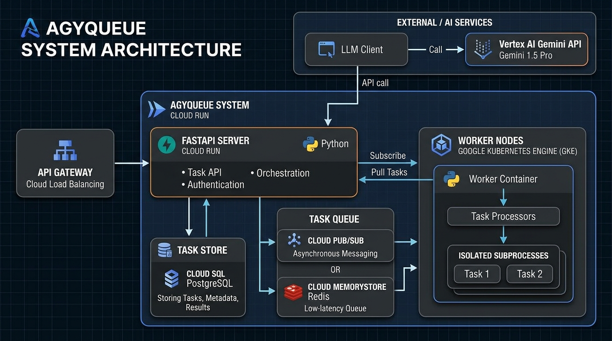

# AgyQueue: Non-Blocking Asynchronous Task Execution for AI Agents


AgyQueue is a lightweight, non-blocking asynchronous task execution framework built for AI agents. It allows agents to offload long-running operations—such as code generation, compilation, testing, and validation—to background workers while keeping client conversation threads responsive.

---

## 🚀 Core Capabilities

1. **Asynchronous Task Offloading**: Agents submit tasks via MCP tool calls or REST API requests and immediately receive a `task_id`, returning execution control back to the user chat session.
2. **Resilience & Reconnection**: Task status is saved in a persistent database store, allowing clients to query progress or fetch final outputs even after network drops or worker crashes.
3. **Interactive Console UI**: Built-in dark mode dashboard that visualizes enqueued runs, progress bars, vertical event history timelines (e.g. `WorkflowExecutionStarted`, `WorkflowTaskScheduled`), and aggregated markdown reports.
4. **Well-Architected Architecture**:
   * **Threaded Connection Pooling**: Uses `ThreadedConnectionPool` for PostgreSQL backend tasks, preventing socket exhaust under high concurrent query volumes.
   * **Graceful Shutdown**: Catches `SIGTERM` / `SIGINT` signals, allowing workers to finish their active task run cleanly before eviction.
   * **Workspace Isolation**: Spawns copy-on-write scratch worktree folders for subprocess executions, ensuring zero file-system cross-interference.
5. **Configurable Multi-Channel Notifications**: Real-time push notifications over Slack webhook and SMTP Email when tasks hit terminal states.
6. **Model Context Protocol (MCP) Support**: Serves as a standard stdio/sse MCP server compatible with Cursor, Claude Desktop, Claude Code, and Copilot CLI.

---

## 🛠️ Architecture

AgyQueue supports both hybrid cloud-agnostic execution flows and fully-managed Google Cloud configurations:

### 1. Cloud-Agnostic Core Flow


### 2. Google Cloud Native Production Deployment


### Google Cloud & Google AI Managed Services Mapping

When migrating from local development/fallback to production cloud scaling, AgyQueue integrates natively with Google Cloud managed services:

| Component | Dev Fallback | Production GCP Service |
| :--- | :--- | :--- |
| **Agent Reasoning Core** | Local LLM | **Vertex AI Gemini API** (Gemini 2.5 Flash / Pro) |
| **API Server Compute** | Local Python Process | **Google Cloud Run** (Event-driven serverless container) |
| **Worker Node Compute** | Local Daemon Process | **Google Kubernetes Engine (GKE)** or **Cloud Run Jobs** |
| **Task Message Broker** | SQLite (FIFO Table) | **Google Cloud Pub/Sub** or **Cloud Memorystore for Redis** |
| **Persistent Task Store** | SQLite Database | **Google Cloud SQL for PostgreSQL** or **Cloud Spanner** |
| **Workspace Repos** | Local Directory | **Google Cloud Storage (GCS)** Buckets |
| **Traffic Router** | Direct Port Binding | **Google Cloud Load Balancing** (HTTPS Layer 7 Router) |

---

## 📦 Installation & Setup

### Install as Python Package (Local Development)
You can install AgyQueue locally in editable mode for development and testing:
```bash
python3 -m venv .venv
source .venv/bin/activate
pip install -e .
cp .env.example .env
```

### Install from PyPI
Once published, users can install AgyQueue directly from PyPI:
```bash
pip install agyqueue
```

---

## 🏁 Quick Start

### 1. Run Standalone Dev Demo
Spins up a local server, enqueues an SRE compliance check and FastAPI code generator workflow, executes it in isolated directories, and outputs the final report:
```bash
python examples/demo.py
```

### 2. Open the Web Console Dashboard
Start the standalone SSE server and background worker:
```bash
# Terminal 1: Start Server
export AGYQUEUE_TRANSPORT=sse
python -m agyqueue.mcp_server

# Terminal 2: Start Worker
python -m agyqueue.worker
```
Navigate to [http://localhost:8000/dashboard](http://localhost:8000/dashboard) to submit runs, inspect progress, and view timeline event history logs.

---

## 📁 Examples & Client Integrations

The [examples/](examples/) folder contains detailed client scripts for every connection method:

* **Antigravity 2.0 SDK**: [examples/antigravity_agent_sdk.py](examples/antigravity_agent_sdk.py) shows how to bind tools to a `google.antigravity` agent.
* **Google ADK Agents**: [examples/google_adk_agent.py](examples/google_adk_agent.py) demonstrates tool binding in the `google.adk.agents` framework.
* **StdIO MCP Client**: [examples/mcp_stdio_client.py](examples/mcp_stdio_client.py) connects programmatically via stdin/stdout subprocesses.
* **SSE MCP Client**: [examples/mcp_sse_client.py](examples/mcp_sse_client.py) connects over network Server-Sent Events.
* **Direct REST SDK**: [examples/rest_client_sdk_demo.py](examples/rest_client_sdk_demo.py) performs calls using the lightweight `AgyQueueClient` Python client.

---

## 🔌 Connecting to Agentic Frameworks

### 1. Google Agent Development Kit (ADK) & Agent Engine
The Google **ADK** allows Python-defined agents to be deployed to **Agent Engine** (Vertex AI Reasoning Engine). Import and register AgyQueue's functional tools directly:

```python
from google.adk.agents import Agent
from agyqueue.client import submit_async_task, check_task_progress, get_task_output, cancel_running_task

# Define the coordinator agent
orchestrator_agent = Agent(
    name="deployment_coordinator",
    model="gemini-3.5-flash",
    instruction=(
        "You coordinate SRE compliance checks and API code generation workloads. "
        "Use submit_async_task to spawn background jobs. Do not wait for jobs in a loop. "
        "Return the task_id to the user/orchestrator so that progress can be tracked asynchronously."
    ),
    tools=[
        submit_async_task,
        check_task_progress,
        get_task_output,
        cancel_running_task
    ]
)
```

### 2. Registering with Agent Registry as MCP Server
To register AgyQueue with your Google Cloud Agent Registry as an MCP server, run the following:
```bash
agents-cli publish gemini-enterprise \
  --name "agyqueue" \
  --description "A pluggable, non-blocking asynchronous task queue and MCP server for AI Agents." \
  --url "https://<your-agyqueue-server-url>/sse" \
  --type "mcp"
```

For the **Gemini CLI / Antigravity CLI (`agy`)**, you can install this repository directly as a fully compatible local/remote extension by running:
```bash
agy plugin install .agents
```
*(The repository is configured as a native Gemini extension via `gemini-extension.json` and `.agents/` metadata).*

---

## 💻 Local IDE & AI CLI Integration (MCP)

To make it incredibly easy for anyone cloning or using this repository, we have provided pre-configured JSON snippets and integration files for all major AI-based development platforms inside the `mcp-configs/` directory.

### 🚀 Direct Integration Files
*   **Claude Code CLI**: Add the server config in `mcp-configs/claude_code_config.json` to your `~/.config/claude-code/mcp.json`.
*   **Claude Desktop**: Copy the snippet in `mcp-configs/claude_desktop_config.json` to your `claude_desktop_config.json`.
*   **Cursor IDE**: Add a new MCP server in Cursor Settings under **Features -> MCP** using the parameters specified in `mcp-configs/cursor_config.json`.
*   **Windsurf IDE**: Add the server config in `mcp-configs/windsurf_config.json` to your `~/.codeium/windsurf/mcp_config.json`.
*   **VS Code (Cline / Roo Code / Copilot / Codex / others)**: Append the server config in `mcp-configs/copilot_config.json` to your `cline_mcp_settings.json` or Copilot MCP configuration.

### 🛠️ Configuration Quick-Reference

#### Claude Desktop Configuration
Add the following to your `claude_desktop_config.json` (located in `~/Library/Application Support/Claude/` on macOS):
```json
{
  "mcpServers": {
    "agyqueue": {
      "command": "python",
      "args": ["-m", "agyqueue.mcp_server"],
      "env": {
        "PYTHONPATH": "/absolute/path/to/your/agyqueue/repo",
        "AGYQUEUE_TRANSPORT": "stdio",
        "AGYQUEUE_DB_PATH": "/absolute/path/to/your/agyqueue/repo/agyqueue.db"
      }
    }
  }
}
```

#### Gemini CLI & Antigravity CLI Configuration
To configure AgyQueue as an MCP server inside your global Gemini/Antigravity CLI settings (located at `~/.gemini/GEMINI.md` or user preferences), append the server config under the `"mcpServers"` dictionary:

##### Option A: Local StdIO Execution
```json
{
  "mcpServers": {
    "agyqueue": {
      "command": "python",
      "args": ["-m", "agyqueue.mcp_server"],
      "env": {
        "PYTHONPATH": "/absolute/path/to/your/agyqueue/repo",
        "AGYQUEUE_TRANSPORT": "stdio",
        "AGYQUEUE_DB_PATH": "/absolute/path/to/your/agyqueue/repo/agyqueue.db"
      }
    }
  }
}
```

##### Option B: Remote SSE (Server-Sent Events) Service
```json
{
  "mcpServers": {
    "agyqueue": {
      "command": "npx",
      "args": [
        "-y",
        "@modelcontextprotocol/client-sse",
        "https://<your-agyqueue-server-url>/sse"
      ]
    }
  }
}
```

#### Cursor Configuration
1. Open Cursor Settings -> Features -> MCP.
2. Click **+ Add New MCP Server**.
3. Configure:
   * **Name**: `AgyQueue`
   * **Type**: `command`
   * **Command**: `PYTHONPATH=. .venv/bin/python -m agyqueue.mcp_server` (relative to your repo path).

#### VS Code Configuration (Cline / Roo Code / Copilot / Codex)
Append the AgyQueue stdio server configuration to your MCP settings file:
```json
{
  "mcpServers": {
    "agyqueue": {
      "command": "python",
      "args": ["-m", "agyqueue.mcp_server"],
      "env": {
        "PYTHONPATH": "/absolute/path/to/your/agyqueue/repo",
        "AGYQUEUE_TRANSPORT": "stdio",
        "AGYQUEUE_DB_PATH": "/absolute/path/to/your/agyqueue/repo/agyqueue.db"
      }
    }
  }
}
```

#### Claude Code CLI Integration
Add AgyQueue as a local tool under the `"mcpServers"` dictionary in `~/.config/claude-code/mcp.json` using the SSE endpoint:
```json
{
  "mcpServers": {
    "agyqueue": {
      "command": "npx",
      "args": [
        "-y",
        "@modelcontextprotocol/client-sse",
        "https://<your-agyqueue-server-url>/sse"
      ]
    }
  }
}
```

---

## 🌳 Multi-Agent Tree-Based Orchestration Pattern

AgyQueue natively supports **parent-child task aggregation**. When an orchestrator agent splits a large request into parallel child workloads, it submits the subtasks with a `parent_id` parameter:

1. **Task Submission**:
   * The orchestrator spawns subagents by submitting child tasks referencing the parent ID.
   * The parent task status transitions to `WAITING`.
2. **Worker Isolation**:
   * Background workers pick up and execute child tasks in isolated workspaces (`git_worktree` or copy-on-write temp folders) in parallel.
3. **Automatic Resumption**:
   * As soon as the final sibling completes, the worker recognizes that all siblings are done and automatically re-queues the parent task.
   * The orchestrator wakes up, reads the logs of all completed subtasks, aggregates the results, and marks the parent task as `COMPLETED`.

---

## 🎭 Live Walkthrough: Human-in-the-Loop SRE Compliance

Want to see how this works in practice? We have recorded and documented a live, step-by-step terminal execution walkthrough of the Multi-Agent human-approval workflow.

It covers:
* **Automatic workspace isolation** via Git worktrees.
* **Real-time linter audits** of Kubernetes manifests.
* **Workflow pausing** at a custom `WAITING` state.
* **External signal triggering** (the SRE manager's human-in-the-loop approval).
* **Automatic patching & resolution**.

👉 **Check out the detailed walkthrough here: [examples/multi_agent_approval_demo_run.md](examples/multi_agent_approval_demo_run.md)**

---

## 🐳 Docker Compose Deployment (Redis + SSE Mode)

To run the complete system with Redis queues and PostgreSQL stores:
1. **Build and Run**:
   ```bash
   docker compose up --build
   ```
2. **Verify over SSE**:
   ```bash
   python examples/mcp_sse_client.py
   ```

---

## ☁️ Cloud Deployment (Cloud Run & GKE)

For Google Cloud production environments, configuration templates are located in [deployment/](deployment/):
* **Cloud Run**: Serverless container setups with Memorystore Redis and Cloud SQL PostgreSQL.
* **GKE**: Scalable Kubernetes microservices with Horizontal Pod Autoscalers (HPA).

---

---

## 🚀 Publishing to PyPI

### Step 1: Install Build Tools
```bash
pip install --upgrade build twine
```

### Step 2: Build the Distribution Package
```bash
python -m build
```

### Step 3: Upload to PyPI
Run twine to securely publish to PyPI under your profile:
```bash
python -m twine upload dist/*
```
Once uploaded, anyone can install and run the AgyQueue CLI globally:
```bash
pip install agyqueue
```
